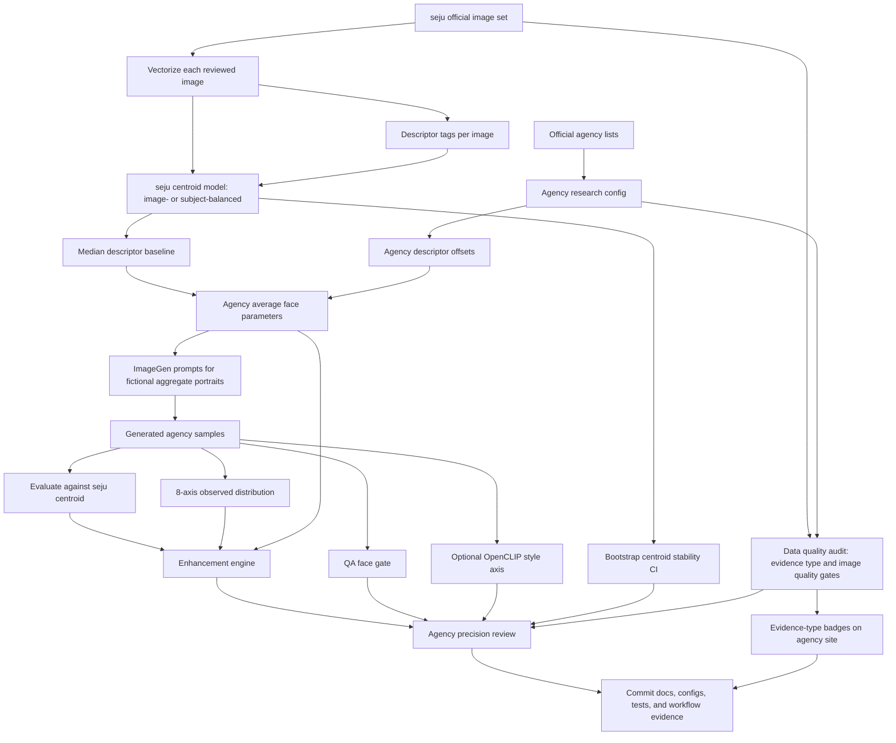
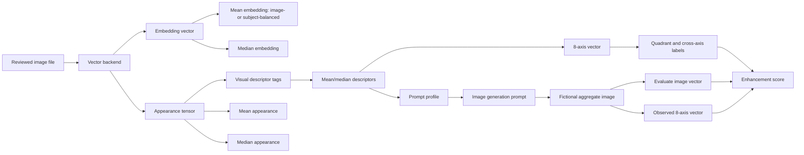

# agency face research flow

Retrieval/design date: 2026-06-15.

This flow compares seju with adjacent talent agencies without turning agency style into
popularity, beauty, or identity labels. Public agency sources provide roster context; local
images and generated samples provide measurable vector evidence.

## Current Evidence Status

- `seju`: local real image data is vectorized, averaged, and saved as mean/median centroids in
  `outputs/seju_model_official/centroids.npz`.
- `seju`: image-level descriptor tags are exported during model build as visual descriptors such
  as luminance, contrast, saturation, warmth, symmetry, edge density, and hair-band darkness.
- Adjacent agencies: current `configs/agencies/seju_like_agencies.json` rows are official-source
  research hypotheses plus descriptor offsets over the seju median baseline.
- Adjacent agencies: generated aggregate images are vectorized and scored, but non-seju agencies
  are not yet averaged from real per-talent image sets unless a local agency-specific image folder
  is added.
- `outputs/agency_subject_reviews/subject_reviews.html` is currently a subject-review-format
  comparison of generated agency aggregate images, not a real per-talent review for those agencies.



## Full Logic: Data to Prompt



## Logic

- `official_source`: record official agency URLs and public examples.
- `image_vectorization`: turn each reviewed local image into an embedding vector and appearance
  tensor through the selected backend.
- `descriptor_tagging`: record image-level visual descriptor tags: `luminance`, `contrast`,
  `saturation`, `warmth`, `symmetry`, `edge_density`, `upper_band_darkness`,
  `middle_luminance`, and `lower_luminance`.
- `centroid_model`: average embeddings into `mean_embedding` and `median_embedding`; average
  appearance tensors into `mean_appearance` and `median_appearance`; derive mean/median
  descriptors from those appearances.
- `parameter_hypothesis`: express agency tendencies as transparent descriptor offsets over the
  local seju median centroid.
- `average_profile`: write bounded average descriptors, similarity to seju, and one prompt per
  agency.
- `image_generation`: use Image Gen Skill for fictional aggregate portraits only; never request
  a specific real person's likeness.
- `precision_measurement`: score generated samples with `evaluate`, then keep face vector, QA,
  style, and benchmark notes as separate axes.
- `presentation_guard`: if a sample is dark, off-center, high-contrast, messy-edged, or otherwise
  far from the descriptor center, record image-state flags and an outlier score instead of applying
  insulting labels to a person.
- `enhancement_engine`: combine descriptor similarity, generated-image centroid score, and 8-axis
  alignment into a ranked action list for the next prompt or data-collection pass.
- `centroid_model` aggregation: average per image (`image_weighted`) or per subject first then across
  subjects (`subject_balanced` via `build --balance subject`) so image-heavy subjects cannot dominate.
- `centroid_stability`: at build time, bootstrap the centroid by resampling subjects/images and record
  the resampled self-cosine mean and CI in `vectors/centroid_stability.json` as a local
  data-confidence signal; `audit-model` surfaces it. Band thresholds are heuristic candidates.
- `data_quality_gate`: `scripts/audit_research_data_quality.py` classifies per-agency evidence type
  (`real_centroid_baseline`, `hypothesis_and_generated`, `real_and_generated`) and image-quality
  risks; the agency site renders these as evidence badges before any score is interpreted.

## Tag Layers

- `source tags`: agency slug, public examples, official source URL, and positioning text from
  `configs/agencies/seju_like_agencies.json`.
- `descriptor tags`: numeric image descriptors from vectorization and appearance aggregation.
- `8-axis tags`: `soft_defined`, `cool_warm`, `deep_bright`, `natural_styled`, `muted_vivid`,
  `soft_crisp`, `light_dark_hair`, and `dynamic_symmetric`.
- `distribution tags`: quadrant, corner, cross-axis label, presentation flags, and outlier score.
- `prompt tags`: detector-friendly/balanced prompt profile, centroid kind, negative prompt, seed,
  and regeneration priority.

## Current Command Shape

```powershell
python -m seju_face_lab review-agencies --model outputs/seju_model_official --agencies configs/agencies/seju_like_agencies.json --out outputs/agency_reviews/seju_like
python -m seju_face_lab evaluate --model outputs/seju_model_official --images outputs/agency_imagegen_samples --out outputs/agency_imagegen_eval
python -m seju_face_lab enhance-agencies --model outputs/seju_model_official --agencies configs/agencies/seju_like_agencies.json --images outputs/agency_imagegen_samples --out outputs/agency_enhancement
python -m seju_face_lab calibrate-agency-generation --enhancement outputs/agency_enhancement/agency_enhancement_report.json --agency-params outputs/agency_reviews/seju_like/agency_average_params.json --out outputs/agency_generation_calibration
```

## Boundaries

- Agency descriptors are research hypotheses unless backed by a local image set.
- Generated images are fictional aggregate samples, not talent likenesses.
- Terms such as poor presentation, underlit, occluded, high texture, or off-center describe the
  image state only. The system must not label a person as ugly, dirty, unclean, or low value.
- Do not combine iris templates, face embeddings, style embeddings, and SNS engagement into one
  identity-like score.
