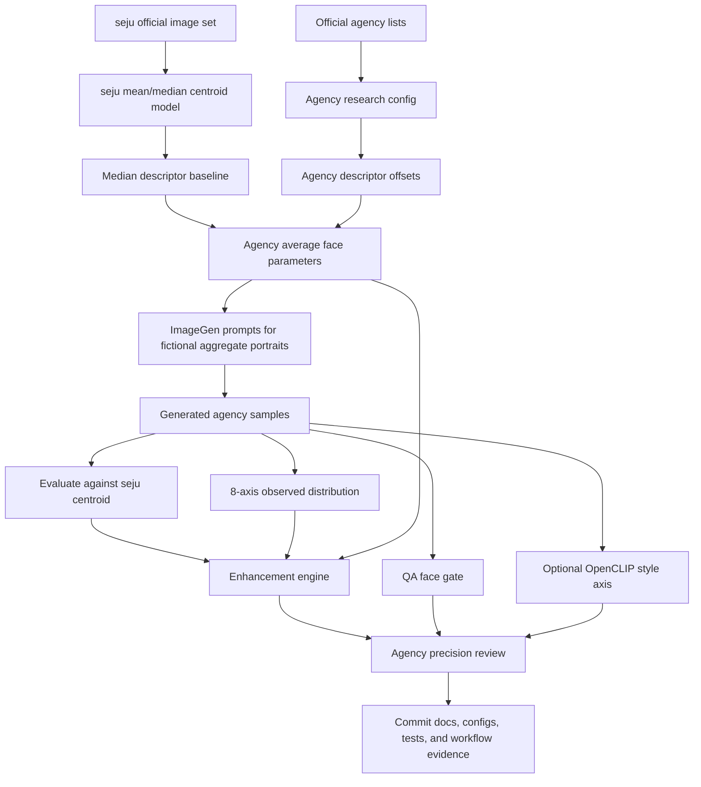

# agency face research flow

Retrieval/design date: 2026-06-15.

This flow compares seju with adjacent talent agencies without turning agency style into
popularity, beauty, or identity labels. Public agency sources provide roster context; local
images and generated samples provide measurable vector evidence.



## Logic

- `official_source`: record official agency URLs and public examples.
- `parameter_hypothesis`: express agency tendencies as transparent descriptor offsets over the
  local seju median centroid.
- `average_profile`: write bounded average descriptors, similarity to seju, and one prompt per
  agency.
- `image_generation`: use Image Gen Skill for fictional aggregate portraits only; never request
  a specific real person's likeness.
- `precision_measurement`: score generated samples with `evaluate`, then keep face vector, QA,
  style, and benchmark notes as separate axes.
- `presentation_guard`: if a sample is dark, off-center, high-contrast, messy-edged, or otherwise
  far from the descriptor center, record image-state flags and an outlier score instead of applying
  insulting labels to a person.
- `enhancement_engine`: combine descriptor similarity, generated-image centroid score, and 8-axis
  alignment into a ranked action list for the next prompt or data-collection pass.

## Current Command Shape

```powershell
python -m seju_face_lab review-agencies --model outputs/seju_model_official --agencies configs/agencies/seju_like_agencies.json --out outputs/agency_reviews/seju_like
python -m seju_face_lab evaluate --model outputs/seju_model_official --images outputs/agency_imagegen_samples --out outputs/agency_imagegen_eval
python -m seju_face_lab enhance-agencies --model outputs/seju_model_official --agencies configs/agencies/seju_like_agencies.json --images outputs/agency_imagegen_samples --out outputs/agency_enhancement
```

## Boundaries

- Agency descriptors are research hypotheses unless backed by a local image set.
- Generated images are fictional aggregate samples, not talent likenesses.
- Terms such as poor presentation, underlit, occluded, high texture, or off-center describe the
  image state only. The system must not label a person as ugly, dirty, unclean, or low value.
- Do not combine iris templates, face embeddings, style embeddings, and SNS engagement into one
  identity-like score.
