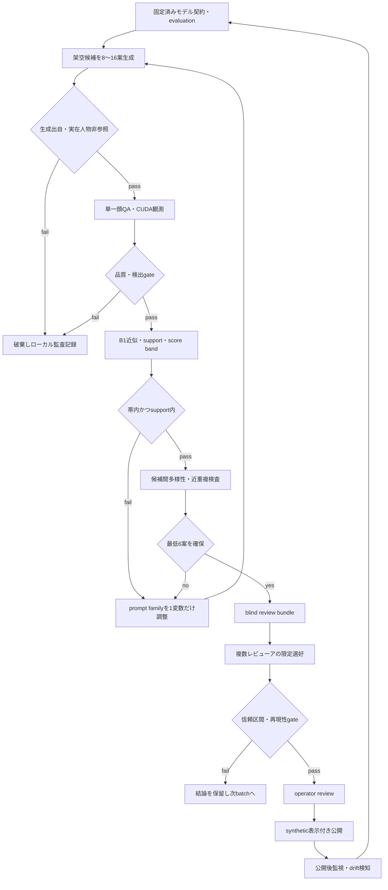

# Seju Vector 強化ループ設計

最終更新: 2026-08-25

## 目的と結論の範囲

このループの目的は、実在人物を再現しない架空候補について、ローカルの`Seju近似スコア`の再現性、技術品質、多様性、限定パネルの反応を継続して検証することである。

顔から「人気」を予測・断定しない。人手レビューが十分に集まった場合も、結果は指定パネルの選好に限られ、一般社会の人気・魅力・価値・所属可能性を意味しない。

## 現在の基準線

- データ: 34人物、224件の単一顔観測、出自・hash・signature assetを事前検査済み。
- モデル: 人物分離LOSOとCUDA摂動試験を通過した`B1`（robust global center）。
- C1: 改善信頼区間が0をまたいだため不採用。再評価対象として保持するが、スコアリングには使わない。
- 公開候補: 架空画像5案のうち、QA・support・事前近似帯（70–90）を同時に通過した候補が1案。候補間の優劣・選好結論はまだ出せない。

## 全体ループ

## 各gateと責任分離

| 段階 | 入力 | 合格条件 | 出力 | 公開可否 |
|---|---|---|---|---|
| 0. モデル固定 | contract、LOSO、摂動証跡 | promotion=`promoted` | immutable evaluation bundle | 不可 |
| 1. 生成 | text-only fictional prompt | 実在人物・参照画像・固有名なし | private generation manifest | 不可 |
| 2. 技術QA | 生成画像 | 単一中央顔、品質閾値、検出成功 | QA JSON | 不可 |
| 3. 近似 | B1、LOSO校正 | support内、事前score band | local score artifact | 不可 |
| 4. 多様性 | 合格候補集合 | duplicateなし、component距離の下限 | Pareto frontier | 不可 |
| 5. 人手レビュー | blind bundle | 3人以上、各比較の回答数を記録 | panel-only summary | 条件付き |
| 6. 公開 | public bundle | operator承認、合成ラベル、秘密除去 | static preview | 可 |
| 7. 監視 | 公開版・新規データ | drift/誤表示/opt-outなし | 次runの判断 | 不可 |

`Seju近似`、候補多様性、レビュー選好を一つの総合順位に合成しない。各値は別の問いに答える。

## 生成と探索のルール

1. 一度のbatchは8〜16案。プロンプトは髪・背景・服・光のうち一度に1変数だけ変更する。
2. 実在人物名、事務所メンバー名、画像参照、顔swap、似顔指示を禁止する。
3. 初期探索帯は70–90。帯外は「失敗」ではなく、次のprompt familyを測る対照群としてローカルだけに残す。
4. 公開候補は最低6案を確保するまで比較・選好を始めない。1案だけなら技術プレビューに留める。
5. 多様性は架空候補間だけで測り、学習側の人物へのnearest-person検索に使わない。

## Presentation QA（清潔感・撮影品質を取りこぼさないための追加gate）

`Seju近似スコア`は顔ベクトルの相対近似であり、画像の仕上がりを測らない。したがって公開候補には、顔の魅力度を採点しない`presentation QA`を別途必須にする。

| 層 | 自動検査 | 人手確認 | 失格例 |
|---|---|---|---|
| 構図 | 単一顔、中心、face area | 不自然な極端クロップがない | 複数顔、顔欠け |
| 露出・色 | 明部/暗部clip、顔領域の明度、white balance | くすみ、過剰な黄/緑かぶりがない | 暗すぎ、白飛び、色転び |
| 解像・ノイズ | blur/edge sharpness、JPEG block、生成artifact | 目・口・輪郭に破綻がない | にじみ、輪郭崩れ |
| 髪・遮蔽 | 顔ランドマーク周辺の遮蔽率 | 前髪/飛び毛が顔の読み取りを損なわない | 目元への強い毛かかり |
| 肌・光 | specular highlight比、局所コントラスト | 汗・油分のような不自然な光沢、粗いパッチ感がない | 斑、過剰な反射 |

自動検査は再現可能な画像状態だけを測る。最後の公開判定は、少なくとも2人のレビューアが「画像状態として問題なし」と確認してから行う。これは人の美醜を採点する工程ではなく、合成画像の品質・誤認防止工程である。

今回の候補Aは、単一顔QAとB1近似帯を通過した一方、`realistic skin texture`、`honest editorial`、glamour抑制のprompt指定により、肌の局所コントラストと髪の乱れを自然さとして残した。この層を測っていなかったことが、公開前の取りこぼし原因である。

## 人手レビューの設計

blind bundleでは候補IDを`R001`形式に置換し、generator、seed、score、component座標、promptを隠す。質問は次の3つに固定する。

- 印象に残る
- 応援したい
- SNSで見たい

回答は`left`、`right`、`tie`、`abstain`。各質問について回答数、decisive比較数、Wilson 95%区間、パネルの属性ではなくパネル範囲を記録する。3人未満、または各比較のdecisive回答が少なすぎる場合は「結論なし」とする。

## モデル更新の条件

候補生成の結果で学習モデルを自動更新しない。新しい許諾済みデータを追加する場合だけ、次を満たした独立runを要求する。

- source/consent/hash/signature gateを再実行
- 人物単位のtrain/holdoutを再作成
- B1とC1を同じLOSO条件で再評価
- CUDAを含む摂動試験、backend agreement、bootstrap信頼区間を更新
- 新旧モデルのcontract hash、校正分布、score driftを比較
- operator承認後にのみpromotion。旧モデルは再現用に保持する

## 監視と停止条件

即時停止し公開を取り下げる条件は、実在人物との混同リスク、無断データ混入、合成ラベル欠落、multi-face/quality gateの破綻、model contract不一致、公開ページから秘密artifactが参照可能な場合である。

通常停止は、candidate pass率が10%未満で3 batch連続、検出率が95%未満、摂動劣化p90が0.08超、reviewer間の不確実性が大きい場合に行う。停止時は再生成ではなく、失敗カテゴリ・prompt差分・backend状態を先に監査する。

## 運用ダッシュボード

各batchでは次だけを集約表示する。

| 指標 | 目的 |
|---|---|
| 生成数 / QA通過率 / score帯通過率 | 生成条件の健全性 |
| support外率 / detector dropout率 | モデル適用範囲の監視 |
| 候補間最小距離 | 架空候補の重複防止 |
| blind reviewの回答数・区間 | パネル選好の不確実性 |
| contract hash・backend・seed/prompt hash | 再現性 |
| 公開artifact検査 | 個人データ・座標・個別scoreの流出防止 |

公開ページには個別score、component座標、prompt全文、seed、学習側人物名、raw画像、埋め込みを載せない。

## 次の実行順

1. 8〜16案のtext-only fictional batchを作る。
2. QA、B1、support、diversityで最低6案まで絞る。
3. 3人以上の限定パネルでblind reviewを実施する。
4. 信頼区間を含む集約結果をoperatorが確認する。
5. 合成ラベルと境界文を固定したpublic-safe previewだけを公開する。
6. 新データがある場合だけモデル更新runへ進む。
