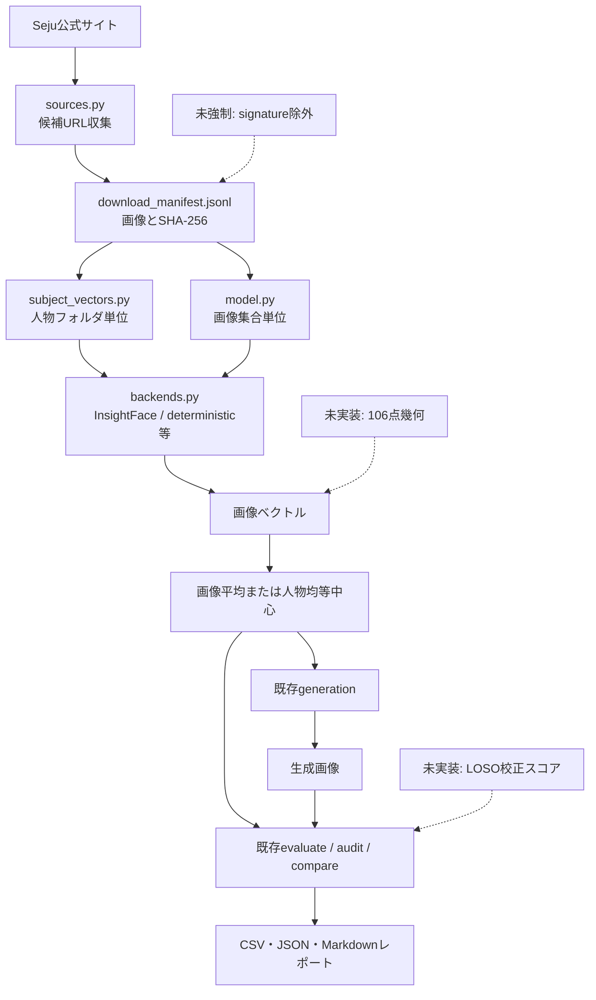
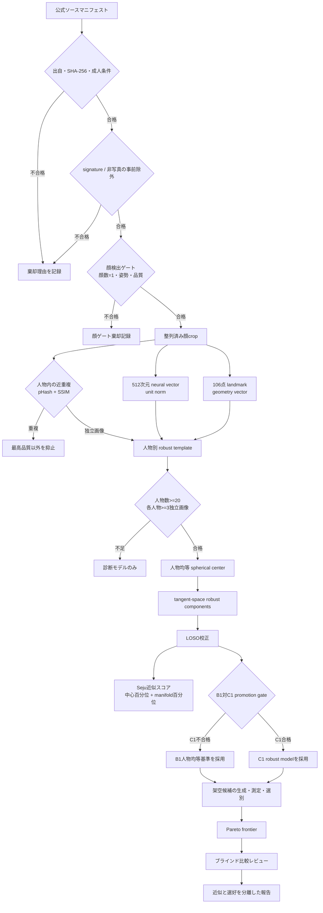
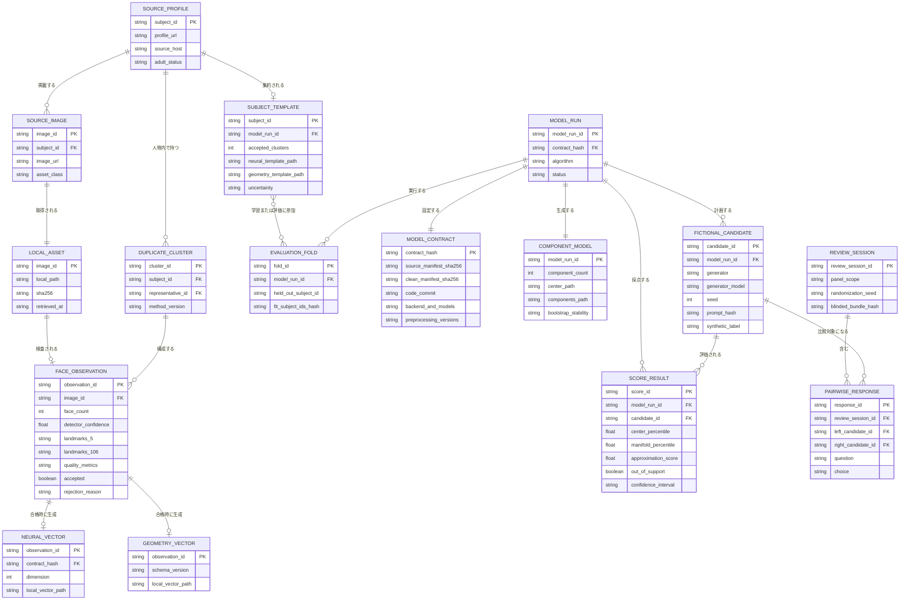
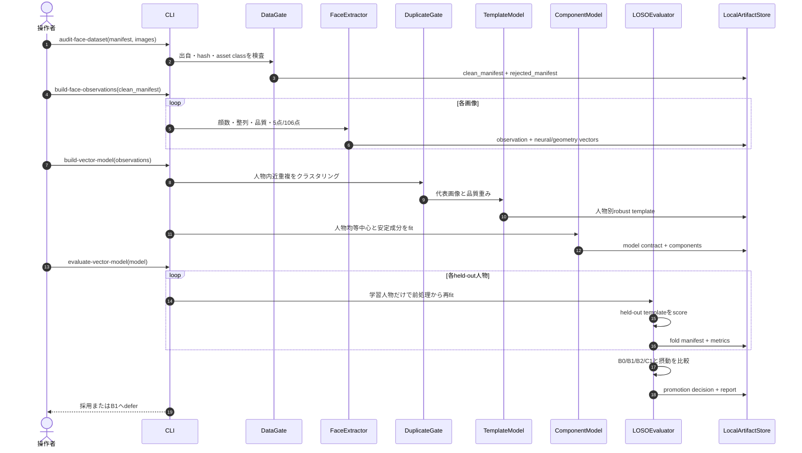
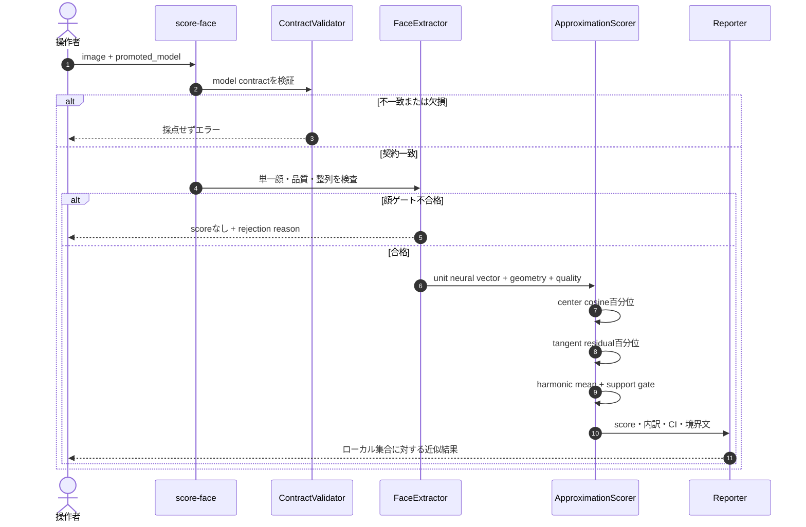
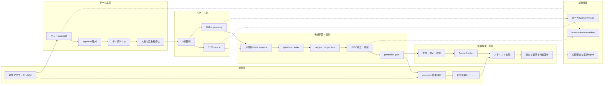
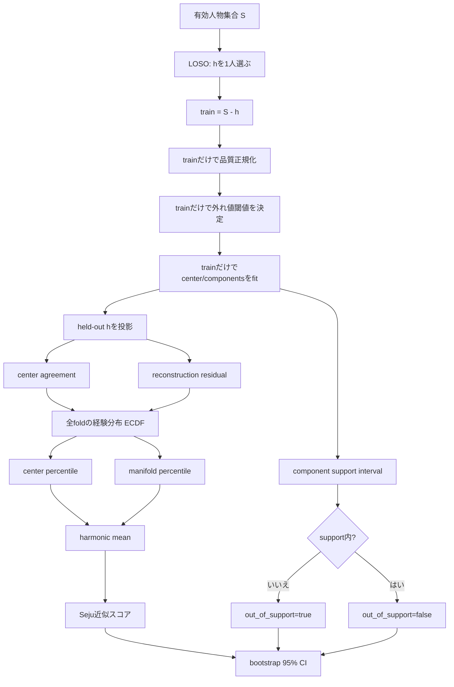
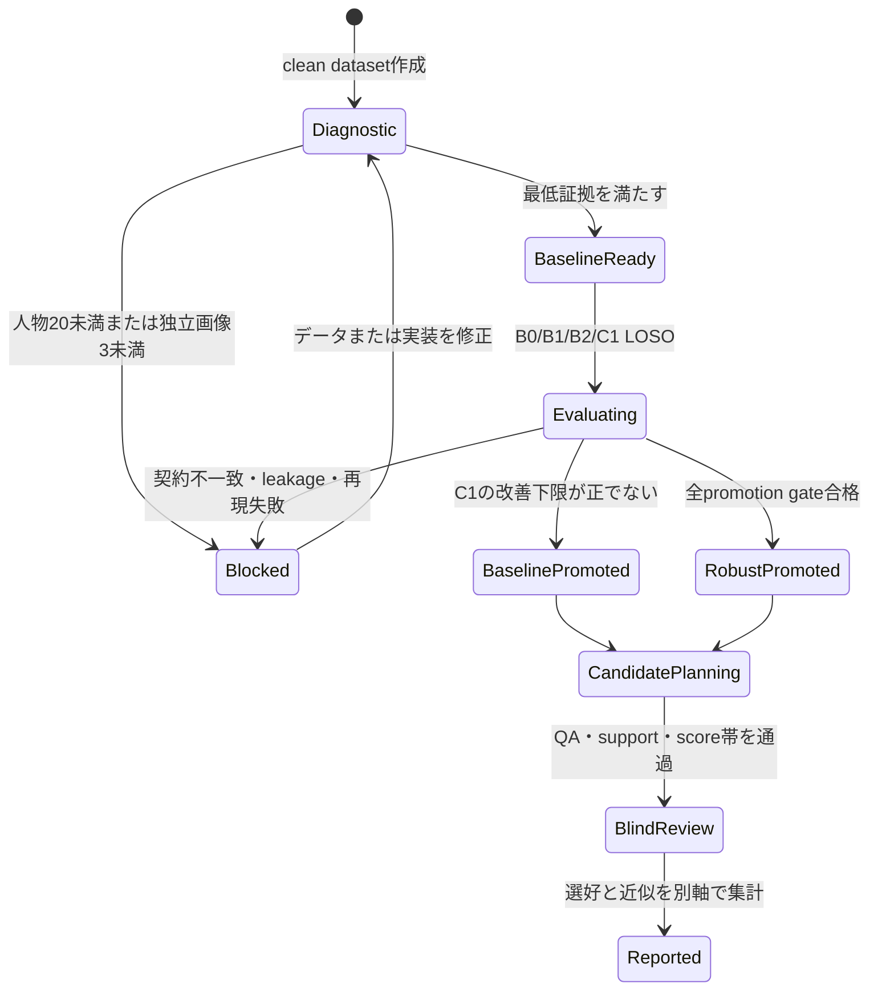

# Seju顔ベクトル化・分析・機械学習 全体仕様（日本語レビュー版）

更新日: 2026-08-25  
対象仕様: `docs/superpowers/specs/2026-08-25-seju-vector-decomposition-candidate-search-design.md`  
対象実装: `seju-face-lab` のローカル研究パイプライン

## 1. 目的と結論

このシステムは、Seju公式サイトのローカル保存画像だけを対象に、顔画像をベクトル化し、個人ごとの撮影差を抑えたうえで、Seju画像集合に共通する局所的な構造を分析する。

主要な出力は次の二つである。

1. **Seju近似スコア**: クリーンなSejuローカル画像集合の中心性と部分空間内包性を、LOSO（1人物を丸ごと除外する交差検証）で校正した0〜100の局所百分位。
2. **架空候補探索**: 近似スコアだけを最大化せず、安定成分内の支持、画像品質、候補間多様性、匿名レビュー結果を別軸で保持する候補集合。

このスコアは所属確率、本人照合、魅力度、人格、人口統計、人気予測ではない。「人気」は顔ベクトルから推定せず、架空候補に対するブラインド比較で別に測る。

## 2. 現行（As-Is）フロー

現行コードは、画像収集、複数バックエンドでのベクトル化、平均・中央値モデル、生成画像評価、各種レポートを持つ。一方、データゲート、モデル契約、人物分離LOSO、106点幾何、近似スコアの校正は一つの強制パイプラインになっていない。



### 現行監査で確認済みの状態

- 35プロフィールから265候補、成人条件を満たす34プロフィール259ファイル。
- 259ファイルは欠損0、SHA-256不一致0、URLホストはすべて`seju.tokyo`。
- signature画像34枚が現行モデルに混入。
- InsightFaceはsignature 34枚と通常画像1枚を棄却し、224枚を採用。
- 33件のサムネイル候補は、知覚ハッシュとSSIMによる近重複判定が未完了。

したがって、現行のベクトル生成成功は確認できるが、現行中心ベクトルを「Seju顔モデル合格」とは扱わない。

## 3. 目標（To-Be）全体フローチャート



## 4. データモデル（ER図）

顔画像、ベクトル、人物テンプレート、学習fold、候補、レビューを追跡可能にする。生ベクトルと画像はローカルのみで、Gitへコミットしない。



## 5. 学習モデル構築シーケンス図



## 6. 1画像を採点するシーケンス図



## 7. スイムレーン図



## 8. 機械学習・校正フロー



スコア式は次のとおりである。

```text
center_percentile = ECDF_LOSO(cosine(x, mu)) * 100
manifold_percentile = (1 - ECDF_LOSO(residual(x))) * 100
seju_approximation = harmonic_mean(center_percentile, manifold_percentile)
```

品質値は採点式に加算しない。品質とcomponent supportは、採点可能性および信頼度のゲートとして扱う。

## 9. promotion判定状態図



## 10. ベースラインと採用条件

| ID | 手法 | 人物均等 | 球面処理 | 品質考慮 | robust components |
|---|---|---:|---:|---:|---:|
| B0 | 画像重み付き算術平均 | いいえ | いいえ | いいえ | いいえ |
| B1 | 人物均等算術平均 | はい | いいえ | いいえ | いいえ |
| B2 | 人物均等球面平均 | はい | はい | いいえ | いいえ |
| C1 | 品質考慮球面幾何中央値＋安定成分 | はい | はい | はい | はい |

C1は、LOSO安定性の改善に対するbootstrap下限が正であり、worst-decile、摂動耐性、検出率が許容範囲内で、契約検証と再現実行が成功した場合だけ採用する。不合格時は単純なB1へ戻す。

## 11. 架空の3人目候補探索

512次元ベクトルを直接画像へ逆変換しない。生成器で複数候補を作り、同じpromoted modelで測定して残す `generate-measure-select` 方式を使う。

初期探索条件は次のとおり。

- Seju近似スコア70〜90。100を目標にしない。
- 安定component support内。
- 単一顔・画像品質・生成来歴の各ゲートに合格。
- 実在人物名、Seju公式を装う表現、保護属性や魅力ラベルをpromptに含めない。
- 架空候補同士のcomponent距離で多様性を確保。
- 最終判断は近似、support、QA、多様性、ブラインド選好のPareto frontier。

ブラインドレビューでは順序をランダム化し、seed、生成器、スコア、component目標を隠す。質問は `印象に残る`、`応援したい`、`SNSで見たい` を分け、`同程度` と棄権を許す。単独操作者の結果は個人選好であり、世間一般の人気とは表現しない。

## 12. CLIと成果物

| CLI | 入力 | 主な出力 | 失敗時の扱い |
|---|---|---|---|
| `audit-face-dataset` | source/download manifest、画像 | clean/rejected manifest、audit | fail closed |
| `build-face-observations` | clean manifest | observation、neural/geometry vector | 画像単位で理由記録 |
| `build-vector-model` | observations | subject templates、model contract | 証拠不足はdiagnostic |
| `build-vector-model`（分解を内包） | observations | templates、center、components | 最低人物数・独立portrait不足で停止 |
| `evaluate-vector-model` | model、folds | LOSO・摂動・promotion report | leakage/契約不一致で停止 |
| `score-face` | image、promoted model | score内訳・CI・support | ゲート不合格はscoreなし |
| `plan-fictional-candidates` | promoted model、探索設定 | candidate manifest | promotion前は拒否 |
| `review-fictional-candidates` | blind bundle、response | preference report | 近似情報混入で拒否 |

各runは、入力manifest hash、clean manifest hash、コードcommit、backend、detector、recognition model、各model hash、整列法、landmark schema、前処理、集約法、成分法、スコア定義versionを固定した契約を保存する。同じ次元でも契約が異なるベクトルは混合しない。

## 13. 検証マトリクス

| 検証層 | 必須確認 | 成功証拠 |
|---|---|---|
| 静的 | Ruff、構文コンパイル、型・契約キー | exit 0 |
| 単体 | gate、重複、集約、LOSO漏洩防止、score意味 | 全テストpass |
| 統合 | manifest→observation→template→component→score | 固定fixtureで再現一致 |
| 実データ | 259件再監査、signature除外、近重複分類 | 件数と理由付きmanifest |
| GPU | InsightFace CUDAで全有効画像 | provider、runtime、GPU memory |
| 統計 | 全LOSO fold、bootstrap、摂動 | CI・worst-decile・rank stability |
| promotion | B1対C1の事前条件 | 採用または明示defer |
| 候補 | synthetic provenance、score帯、support、QA、多様性 | candidate frontier |
| 人手 | blind順序、質問分離、比較数、panel scope | preference report |
| 安全 | raw vector/画像/人物別順位がGitにない | `git status`とartifact audit |

## 14. 完了条件

ベクトルモデル部分は、以下をすべて満たしたときだけ完了とする。

- 採用画像の出自とSHA-256が一致。
- signature、非顔、複数顔、近重複の余剰が理由付きで除外。
- 20人物以上かつ各人物3独立画像以上。
- neural vectorとgeometry vectorが別契約でversion管理。
- LOSOの学習人物と評価人物が完全分離。
- scoreの局所百分位という意味、CI、support外が表示される。
- B1またはC1のpromotion判断が実測に基づく。
- 本人照合、魅力度、属性、顔からの人気予測を出力しない。

架空候補部分は、promoted modelが存在し、候補がsyntheticとして追跡され、同じ条件でQA・採点され、候補間多様性を持ち、ブラインド選好が近似スコアと分離集計された場合だけ完了とする。

## 15. 実装順序

1. データゲートとclean manifest。
2. モデル契約、顔観測、106点幾何。
3. robust人物テンプレートと球面中心。
4. tangent-space component model。
5. LOSO校正Seju近似スコア。
6. B0/B1/B2/C1、摂動、CUDA実測とpromotion。
7. promoted modelに限定した架空候補planner。
8. 小規模生成・測定・Pareto選別。
9. ブラインド比較と分離レポート。

公開サイト、Discord取り込み、他事務所比較、SNS指標との相関、外部公開はこの仕様の完了条件に含めない。別の安全・権限・公開レビューを必要とする。
